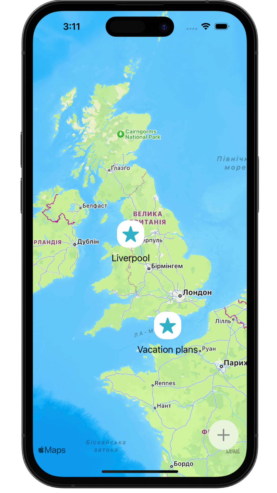
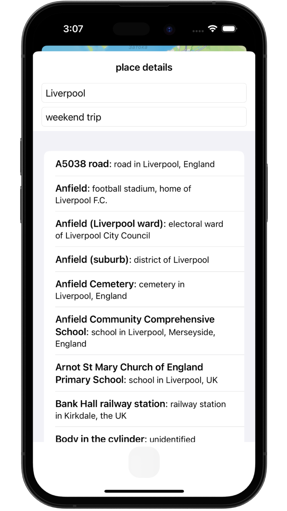

# &nbsp; Bucket List 📍

### Project 14
##### Author: *[MatviiArtemenko](https://github.com/100DaysOfSwiftUI-MatviiArtemenko)*

##### 100DaysOfSwiftUI form *[@twostraws](https://twitter.com/twostraws "twostraws twitter page")*

##### Follow along: *[100DaysOfSwiftUI](https://www.hackingwithswift.com/100/swiftui "Hacking with Swift")*

---

> *This was our biggest project yet, but we’ve covered a huge amount of ground: adding `Comparable` to custom types, finding the documents directory, integrating `MapKit`, using biometric authentication, secure Data writing, and much more. And of course you have another real app, and hopefully you’re able to complete the challenges below to take it further.*

---

## &nbsp; 📚 Covered topics

MapKit, Comparable

---
## &nbsp; 🎖 Challenge
* [x] Our + button is rather hard to tap. Try moving all its modifiers to the image inside the button – what difference does it make, and can you think why?

* [x] Our app silently fails when errors occur during biometric authentication, so add code to show those errors in an alert.

* [x] Create another view model, this time for `EditView`. What you put in the view model is down to you, but I would recommend leaving `dismiss` and `onSave` in the view itself – the former uses the environment, which can only be read by the view, and the latter doesn’t really add anything when moved into the model.
 

---
## &nbsp; 📲 Screenshoot

  
  
  

---
##  &nbsp; 🔍 &nbsp; Resources 

* [Hacking With Swift - BucketList](https://www.hackingwithswift.com/books/ios-swiftui/bucket-list-wrap-up)
* [Apple documentation - MapKit](https://developer.apple.com/documentation/MapKit/)
